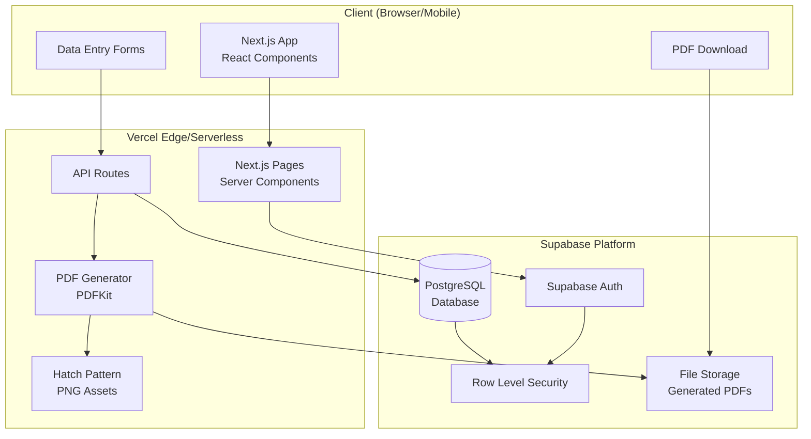
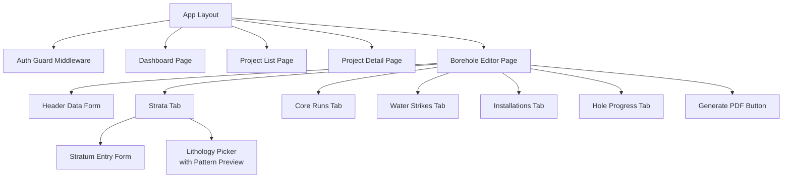
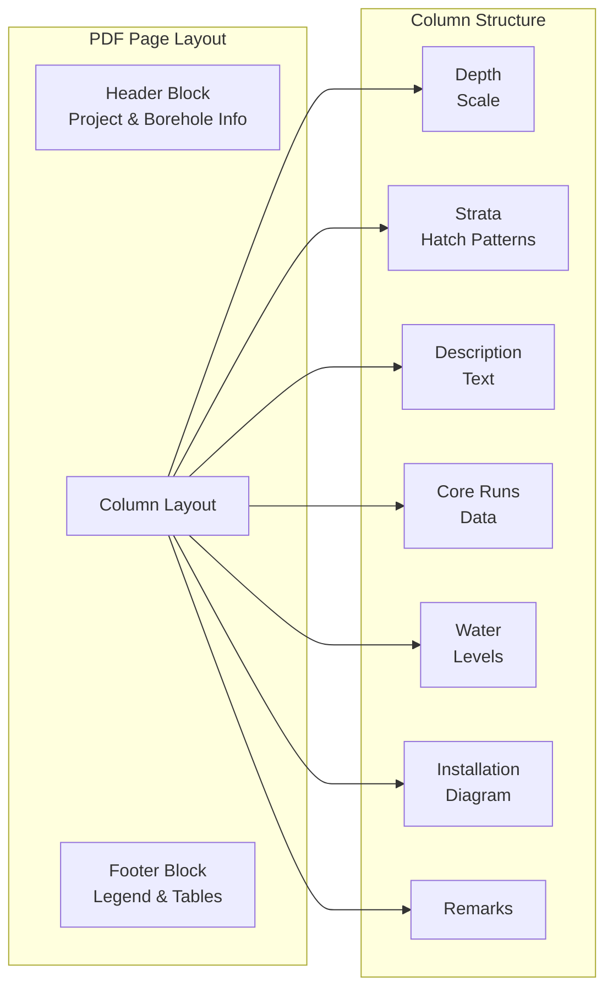
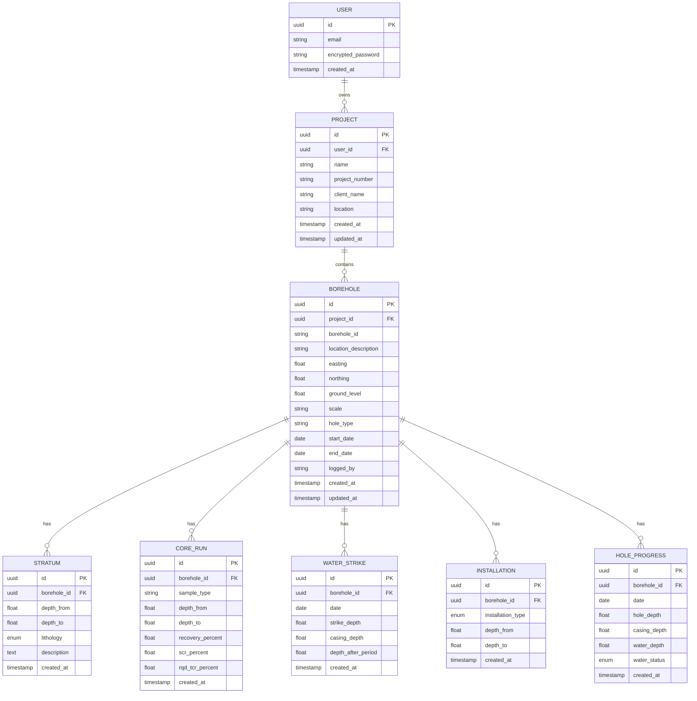

# Design Document: Geodata Borehole Logger

## Overview

The Geodata Borehole Logger is a full-stack web application for geotechnical engineers and field geologists to record borehole data during drilling operations and generate standardised PDF Rotary Borehole Log reports. The application is built as a responsive Progressive Web App (PWA) that works on both desktop and mobile devices.

### Technology Stack

| Layer | Technology | Rationale |
|-------|-----------|-----------|
| Frontend | Next.js 14 (App Router) + React 18 | Server-side rendering, file-based routing, excellent mobile support |
| UI Components | shadcn/ui + Tailwind CSS | Professional design system, accessible components, responsive by default |
| Authentication | Supabase Auth | Email/password, session management, password reset built-in |
| Database | Supabase (PostgreSQL) | Row Level Security, real-time subscriptions, managed hosting |
| PDF Generation | PDFKit (server-side) | Programmatic PDF creation with vector graphics, image tiling, and precise layout control |
| Hatch Patterns | Pre-rendered PNG tile images | BS 5930 compliant geological patterns stored as static assets, tiled into PDF strata columns |
| Deployment | Vercel (frontend) + Supabase (backend) | Zero-config deployment, edge functions, global CDN |
| Language | TypeScript | Type safety across the full stack |

### Key Design Decisions

1. **PDFKit over browser-based PDF**: Server-side PDF generation with PDFKit provides precise control over image tiling for geological hatch patterns, consistent output regardless of client device, and avoids browser memory constraints for large logs.

2. **Pre-rendered PNG hatch pattern tiles**: Rather than generating SVG patterns at runtime, we use pre-rendered 64x64px PNG tile images for each lithology type. These are tiled (repeated) within depth intervals in the PDF to create the standard BS 5930 appearance. This approach ensures consistent, high-quality output and simplifies the rendering pipeline.

3. **Supabase over custom backend**: Supabase provides authentication, database, and Row Level Security in a single platform, reducing development complexity while maintaining security. The PostgreSQL foundation supports the relational data model naturally.

4. **Next.js API Routes for PDF generation**: PDF generation runs as a server-side API route, keeping heavy processing off the client and enabling direct database access for report data assembly.

## Architecture

### System Architecture Diagram



### Request Flow

1. **Authentication**: Client → Supabase Auth → JWT token → All subsequent requests include token
2. **Data Operations**: Client → Next.js API Route → Supabase Client (with RLS) → PostgreSQL
3. **PDF Generation**: Client request → API Route → Fetch borehole data → PDFKit renders PDF with tiled hatch patterns → Store in Supabase Storage → Return download URL

## Components and Interfaces

### Frontend Components



### Core Interfaces

```typescript
// === Domain Types ===

interface Project {
  id: string;
  user_id: string;
  name: string;
  project_number: string;
  client_name: string;
  location: string;
  created_at: string;
  updated_at: string;
}

interface Borehole {
  id: string;
  project_id: string;
  borehole_id: string; // e.g. "BH01"
  location_description: string;
  easting: number;
  northing: number;
  ground_level: number; // mAD
  scale: string;
  hole_type: string;
  start_date: string;
  end_date: string;
  logged_by: string;
  created_at: string;
  updated_at: string;
}

type LithologyType =
  | 'sand'
  | 'clay'
  | 'silt'
  | 'gravel'
  | 'sandstone'
  | 'mudstone'
  | 'limestone'
  | 'chalk'
  | 'made_ground';

interface Stratum {
  id: string;
  borehole_id: string;
  depth_from: number;
  depth_to: number;
  lithology: LithologyType;
  description: string;
  created_at: string;
}

interface CoreRun {
  id: string;
  borehole_id: string;
  sample_type: string;
  depth_from: number;
  depth_to: number;
  recovery_percent: number; // 0-100
  scr_percent: number;      // 0-100
  rqd_tcr_percent: number;  // 0-100
  created_at: string;
}

interface WaterStrike {
  id: string;
  borehole_id: string;
  date: string;
  strike_depth: number;
  casing_depth: number;
  depth_after_period: number;
  created_at: string;
}

type InstallationType =
  | 'plain_casing'
  | 'slotted_casing'
  | 'screen'
  | 'gravel_pack'
  | 'bentonite_seal'
  | 'cement_grout';

interface Installation {
  id: string;
  borehole_id: string;
  installation_type: InstallationType;
  depth_from: number;
  depth_to: number;
  created_at: string;
}

interface HoleProgress {
  id: string;
  borehole_id: string;
  date: string;
  hole_depth: number;
  casing_depth: number;
  water_depth: number | null;
  water_status: 'measured' | 'dry' | 'pumped';
  created_at: string;
}

// === Lithology Pattern Mapping ===

interface LithologyPattern {
  type: LithologyType;
  label: string;
  patternFile: string; // e.g. "sand.png"
  description: string; // e.g. "Stippled dots"
}

// === PDF Generation ===

interface PDFGenerationRequest {
  borehole_id: string;
}

interface PDFGenerationResponse {
  url: string;
  filename: string;
}

// === API Route Interfaces ===

interface ApiResponse<T> {
  data?: T;
  error?: string;
}
```

### API Routes

| Method | Route | Description |
|--------|-------|-------------|
| POST | `/api/auth/login` | Authenticate user |
| POST | `/api/auth/register` | Register new user |
| POST | `/api/auth/reset-password` | Request password reset |
| GET | `/api/projects` | List user's projects |
| POST | `/api/projects` | Create project |
| PUT | `/api/projects/[id]` | Update project |
| DELETE | `/api/projects/[id]` | Delete project (cascade) |
| GET | `/api/projects/[id]/boreholes` | List boreholes in project |
| POST | `/api/boreholes` | Create borehole |
| PUT | `/api/boreholes/[id]` | Update borehole header |
| DELETE | `/api/boreholes/[id]` | Delete borehole (cascade) |
| GET | `/api/boreholes/[id]/strata` | List strata |
| POST | `/api/boreholes/[id]/strata` | Add stratum |
| PUT | `/api/strata/[id]` | Update stratum |
| DELETE | `/api/strata/[id]` | Delete stratum |
| GET | `/api/boreholes/[id]/core-runs` | List core runs |
| POST | `/api/boreholes/[id]/core-runs` | Add core run |
| PUT | `/api/core-runs/[id]` | Update core run |
| DELETE | `/api/core-runs/[id]` | Delete core run |
| GET | `/api/boreholes/[id]/water-strikes` | List water strikes |
| POST | `/api/boreholes/[id]/water-strikes` | Add water strike |
| DELETE | `/api/water-strikes/[id]` | Delete water strike |
| GET | `/api/boreholes/[id]/installations` | List installations |
| POST | `/api/boreholes/[id]/installations` | Add installation |
| DELETE | `/api/installations/[id]` | Delete installation |
| GET | `/api/boreholes/[id]/hole-progress` | List hole progress |
| POST | `/api/boreholes/[id]/hole-progress` | Add hole progress |
| DELETE | `/api/hole-progress/[id]` | Delete hole progress |
| POST | `/api/boreholes/[id]/generate-pdf` | Generate PDF report |

### PDF Generation Component

The PDF generator is the most complex component. It uses PDFKit to produce a multi-column borehole log layout:



**Hatch Pattern Rendering Process:**
1. Load the PNG tile image for the lithology type (64x64px)
2. Calculate the pixel height for the depth interval based on the log scale
3. Create a clipping rectangle for the stratum depth interval
4. Tile the pattern image repeatedly within the clipping rectangle
5. Draw boundary lines between strata

### Lithology Hatch Pattern Specifications

| Lithology | Pattern Description | File |
|-----------|-------------------|------|
| Sand | Stippled dots (random dot pattern) | `sand.png` |
| Clay | Horizontal dashes (short parallel lines) | `clay.png` |
| Silt | Fine vertical lines | `silt.png` |
| Gravel | Circles/rounded shapes | `gravel.png` |
| Sandstone | Brick/block pattern with dots | `sandstone.png` |
| Mudstone | Wavy horizontal lines | `mudstone.png` |
| Limestone | Rectangular block pattern | `limestone.png` |
| Chalk | Cross-hatch pattern | `chalk.png` |
| Made Ground | Irregular random fill (mixed symbols) | `made_ground.png` |

## Data Models

### Entity Relationship Diagram



### Database Schema (PostgreSQL via Supabase)

```sql
-- Projects table
CREATE TABLE projects (
  id UUID PRIMARY KEY DEFAULT gen_random_uuid(),
  user_id UUID NOT NULL REFERENCES auth.users(id) ON DELETE CASCADE,
  name TEXT NOT NULL,
  project_number TEXT NOT NULL,
  client_name TEXT NOT NULL,
  location TEXT NOT NULL,
  created_at TIMESTAMPTZ DEFAULT now(),
  updated_at TIMESTAMPTZ DEFAULT now()
);

-- Boreholes table
CREATE TABLE boreholes (
  id UUID PRIMARY KEY DEFAULT gen_random_uuid(),
  project_id UUID NOT NULL REFERENCES projects(id) ON DELETE CASCADE,
  borehole_id TEXT NOT NULL,
  location_description TEXT DEFAULT '',
  easting DOUBLE PRECISION NOT NULL,
  northing DOUBLE PRECISION NOT NULL,
  ground_level DOUBLE PRECISION NOT NULL,
  scale TEXT NOT NULL DEFAULT '1:50',
  hole_type TEXT NOT NULL DEFAULT 'Rotary',
  start_date DATE,
  end_date DATE,
  logged_by TEXT DEFAULT '',
  created_at TIMESTAMPTZ DEFAULT now(),
  updated_at TIMESTAMPTZ DEFAULT now(),
  UNIQUE(project_id, borehole_id)
);

-- Strata table
CREATE TABLE strata (
  id UUID PRIMARY KEY DEFAULT gen_random_uuid(),
  borehole_id UUID NOT NULL REFERENCES boreholes(id) ON DELETE CASCADE,
  depth_from DOUBLE PRECISION NOT NULL,
  depth_to DOUBLE PRECISION NOT NULL,
  lithology TEXT NOT NULL CHECK (lithology IN ('sand', 'clay', 'silt', 'gravel', 'sandstone', 'mudstone', 'limestone', 'chalk', 'made_ground')),
  description TEXT DEFAULT '',
  created_at TIMESTAMPTZ DEFAULT now(),
  CHECK (depth_from < depth_to)
);

-- Core runs table
CREATE TABLE core_runs (
  id UUID PRIMARY KEY DEFAULT gen_random_uuid(),
  borehole_id UUID NOT NULL REFERENCES boreholes(id) ON DELETE CASCADE,
  sample_type TEXT NOT NULL,
  depth_from DOUBLE PRECISION NOT NULL,
  depth_to DOUBLE PRECISION NOT NULL,
  recovery_percent DOUBLE PRECISION NOT NULL CHECK (recovery_percent >= 0 AND recovery_percent <= 100),
  scr_percent DOUBLE PRECISION NOT NULL CHECK (scr_percent >= 0 AND scr_percent <= 100),
  rqd_tcr_percent DOUBLE PRECISION NOT NULL CHECK (rqd_tcr_percent >= 0 AND rqd_tcr_percent <= 100),
  created_at TIMESTAMPTZ DEFAULT now(),
  CHECK (depth_from < depth_to)
);

-- Water strikes table
CREATE TABLE water_strikes (
  id UUID PRIMARY KEY DEFAULT gen_random_uuid(),
  borehole_id UUID NOT NULL REFERENCES boreholes(id) ON DELETE CASCADE,
  date DATE NOT NULL,
  strike_depth DOUBLE PRECISION NOT NULL,
  casing_depth DOUBLE PRECISION NOT NULL,
  depth_after_period DOUBLE PRECISION NOT NULL,
  created_at TIMESTAMPTZ DEFAULT now()
);

-- Installations table
CREATE TABLE installations (
  id UUID PRIMARY KEY DEFAULT gen_random_uuid(),
  borehole_id UUID NOT NULL REFERENCES boreholes(id) ON DELETE CASCADE,
  installation_type TEXT NOT NULL CHECK (installation_type IN ('plain_casing', 'slotted_casing', 'screen', 'gravel_pack', 'bentonite_seal', 'cement_grout')),
  depth_from DOUBLE PRECISION NOT NULL,
  depth_to DOUBLE PRECISION NOT NULL,
  created_at TIMESTAMPTZ DEFAULT now(),
  CHECK (depth_from < depth_to)
);

-- Hole progress table
CREATE TABLE hole_progress (
  id UUID PRIMARY KEY DEFAULT gen_random_uuid(),
  borehole_id UUID NOT NULL REFERENCES boreholes(id) ON DELETE CASCADE,
  date DATE NOT NULL,
  hole_depth DOUBLE PRECISION NOT NULL,
  casing_depth DOUBLE PRECISION NOT NULL,
  water_depth DOUBLE PRECISION,
  water_status TEXT NOT NULL DEFAULT 'measured' CHECK (water_status IN ('measured', 'dry', 'pumped')),
  created_at TIMESTAMPTZ DEFAULT now(),
  UNIQUE(borehole_id, date)
);

-- Row Level Security policies
ALTER TABLE projects ENABLE ROW LEVEL SECURITY;
ALTER TABLE boreholes ENABLE ROW LEVEL SECURITY;
ALTER TABLE strata ENABLE ROW LEVEL SECURITY;
ALTER TABLE core_runs ENABLE ROW LEVEL SECURITY;
ALTER TABLE water_strikes ENABLE ROW LEVEL SECURITY;
ALTER TABLE installations ENABLE ROW LEVEL SECURITY;
ALTER TABLE hole_progress ENABLE ROW LEVEL SECURITY;

-- Projects: users can only access their own
CREATE POLICY "Users can CRUD own projects" ON projects
  FOR ALL USING (auth.uid() = user_id);

-- Boreholes: users can access boreholes in their projects
CREATE POLICY "Users can CRUD boreholes in own projects" ON boreholes
  FOR ALL USING (
    project_id IN (SELECT id FROM projects WHERE user_id = auth.uid())
  );

-- Strata: users can access strata in their boreholes
CREATE POLICY "Users can CRUD strata in own boreholes" ON strata
  FOR ALL USING (
    borehole_id IN (
      SELECT b.id FROM boreholes b
      JOIN projects p ON b.project_id = p.id
      WHERE p.user_id = auth.uid()
    )
  );

-- Similar policies for core_runs, water_strikes, installations, hole_progress
CREATE POLICY "Users can CRUD core_runs in own boreholes" ON core_runs
  FOR ALL USING (
    borehole_id IN (
      SELECT b.id FROM boreholes b
      JOIN projects p ON b.project_id = p.id
      WHERE p.user_id = auth.uid()
    )
  );

CREATE POLICY "Users can CRUD water_strikes in own boreholes" ON water_strikes
  FOR ALL USING (
    borehole_id IN (
      SELECT b.id FROM boreholes b
      JOIN projects p ON b.project_id = p.id
      WHERE p.user_id = auth.uid()
    )
  );

CREATE POLICY "Users can CRUD installations in own boreholes" ON installations
  FOR ALL USING (
    borehole_id IN (
      SELECT b.id FROM boreholes b
      JOIN projects p ON b.project_id = p.id
      WHERE p.user_id = auth.uid()
    )
  );

CREATE POLICY "Users can CRUD hole_progress in own boreholes" ON hole_progress
  FOR ALL USING (
    borehole_id IN (
      SELECT b.id FROM boreholes b
      JOIN projects p ON b.project_id = p.id
      WHERE p.user_id = auth.uid()
    )
  );
```


## Correctness Properties

*A property is a characteristic or behavior that should hold true across all valid executions of a system — essentially, a formal statement about what the system should do. Properties serve as the bridge between human-readable specifications and machine-verifiable correctness guarantees.*

### Property 1: Data persistence round-trip

*For any* valid entity (Project, Borehole, Stratum, CoreRun, WaterStrike, Installation, or HoleProgress) with randomly generated field values, saving the entity to the data store and then reading it back should produce an object with all fields equal to the original input.

**Validates: Requirements 2.1, 3.2, 4.1, 4.3, 4.5, 5.1, 5.3, 6.1, 6.2, 7.1, 7.3, 8.1, 8.2**

### Property 2: Password validation rules

*For any* randomly generated string, the password validator should accept the string if and only if it has length ≥ 8 AND contains at least one uppercase letter AND contains at least one lowercase letter AND contains at least one digit. All other strings should be rejected.

**Validates: Requirements 1.4**

### Property 3: Project list sort order

*For any* set of projects with varying `updated_at` timestamps, the project list endpoint should return them in strictly descending order of `updated_at` (most recently modified first).

**Validates: Requirements 2.2**

### Property 4: Borehole ID uniqueness within project

*For any* project and any borehole ID string, if a borehole with that ID already exists in the project, attempting to create another borehole with the same ID in the same project should be rejected. The same ID in a different project should be accepted.

**Validates: Requirements 3.4**

### Property 5: Depth interval validation

*For any* pair of depth values (depth_from, depth_to), the system should reject the record if depth_from ≥ depth_to, and accept it if depth_from < depth_to. This applies to Strata, CoreRuns, and Installations.

**Validates: Requirements 5.4**

### Property 6: Strata overlap detection

*For any* two strata within the same borehole, if their depth intervals overlap (i.e., stratum A's depth_from < stratum B's depth_to AND stratum B's depth_from < stratum A's depth_to), the system should produce a validation warning. Non-overlapping intervals should produce no warning.

**Validates: Requirements 4.4**

### Property 7: Percentage range validation

*For any* numeric value, the core run percentage validator (for recovery, SCR, and RQD/TCR) should accept the value if and only if it is in the range [0, 100] inclusive. Values outside this range should be rejected.

**Validates: Requirements 5.2**

### Property 8: Hole progress date uniqueness

*For any* borehole and any date, if a hole progress entry already exists for that date, attempting to create another entry for the same borehole and date should be rejected.

**Validates: Requirements 8.3**

### Property 9: PDF data assembly completeness

*For any* borehole with randomly generated header data, strata, core runs, water strikes, installations, and hole progress entries, the PDF data assembly function should produce an output structure containing all input data fields without loss or corruption.

**Validates: Requirements 9.2, 9.5, 9.6, 9.7, 9.8, 9.9, 9.10, 9.11**

### Property 10: PDF depth scale calculation

*For any* borehole with a given total depth and scale factor, the depth marker calculation should produce markers at regular intervals that span from 0 to the total depth, with the pixel spacing between markers equal to the interval divided by the scale factor multiplied by the points-per-metre constant.

**Validates: Requirements 9.3**

### Property 11: PDF strata pattern layout

*For any* set of strata with varying depths and lithology types, the PDF layout calculator should assign each stratum the correct pattern file for its lithology type, and the pixel bounds (y-start, y-end) should be proportional to the depth interval relative to the total depth and scale.

**Validates: Requirements 9.4**

### Property 12: PDF legend contains used lithologies

*For any* set of strata in a borehole, the generated legend should contain exactly the set of distinct lithology types present in the strata — no more, no less — each with its correct label and pattern image reference.

**Validates: Requirements 9.12**

### Property 13: Referential integrity enforcement

*For any* child record (Borehole, Stratum, CoreRun, WaterStrike, Installation, HoleProgress) with a parent reference (project_id or borehole_id) that does not exist in the database, the system should reject the insert operation.

**Validates: Requirements 11.3**

### Property 14: Cascade delete removes all children

*For any* borehole with N associated strata, M core runs, P water strikes, Q installations, and R hole progress entries, deleting the borehole should result in zero remaining records of any child type associated with that borehole ID.

**Validates: Requirements 11.4**

## Error Handling

### Error Categories and Responses

| Category | Example | User-Facing Behaviour | Technical Handling |
|----------|---------|----------------------|-------------------|
| Validation Error | Invalid depth interval, percentage out of range | Inline error message next to field, form not submitted | Client-side validation + server-side CHECK constraints |
| Authentication Error | Invalid credentials, expired session | Error message on login form / redirect to login | Supabase Auth error codes mapped to user messages |
| Uniqueness Violation | Duplicate borehole ID | Inline error on borehole ID field | Database UNIQUE constraint → 409 Conflict response |
| Network Error | Connection timeout, offline | Toast notification with retry option, form data preserved | Exponential backoff retry, local state preservation |
| Server Error | Database unavailable, PDF generation failure | Generic error toast with support contact | Logged server-side, 500 response with error ID |
| Not Found | Deleted project accessed via stale link | Redirect to project list with "not found" message | 404 response, client-side redirect |

### Validation Strategy

**Client-side (immediate feedback):**
- Required field checks
- Numeric range validation (percentages 0-100)
- Depth interval ordering (from < to)
- Password complexity rules
- Borehole ID format

**Server-side (authoritative):**
- All client-side validations repeated
- Uniqueness constraints (borehole ID per project, hole progress date)
- Referential integrity (foreign keys)
- Strata overlap detection (query-based)
- Row Level Security (authorization)

### PDF Generation Error Handling

- If borehole has no strata data: Generate PDF with empty strata column and a note "No strata recorded"
- If pattern image file is missing: Fall back to a solid grey fill with the lithology label text
- If PDF generation exceeds 10 seconds: Return timeout error, suggest reducing data complexity
- If generated PDF exceeds storage limits: Return error with file size information

### Form Data Preservation

When a save operation fails:
1. The form retains all entered data (no clearing)
2. An error notification appears with the specific failure reason
3. The user can correct the issue and retry without re-entering data
4. For network errors, the system will auto-retry up to 3 times with exponential backoff

## Testing Strategy

### Testing Approach

This project uses a dual testing approach combining unit tests with property-based tests for comprehensive coverage.

### Unit Tests (Example-Based)

**Framework:** Vitest

Unit tests cover:
- Specific UI interaction examples (login flow, form submission)
- Integration points between components (API route → database)
- Error handling scenarios (network failure, invalid responses)
- Edge cases (empty states, boundary values)
- Visual regression at key breakpoints

### Property-Based Tests

**Framework:** fast-check (with Vitest)

Property-based tests verify universal properties across randomly generated inputs. Each property test runs a minimum of 100 iterations.

**Tag format:** `Feature: geodata-borehole-logger, Property {number}: {property_text}`

Properties to implement:
1. Data persistence round-trip (all entity types)
2. Password validation rules
3. Project list sort order
4. Borehole ID uniqueness within project
5. Depth interval validation
6. Strata overlap detection
7. Percentage range validation
8. Hole progress date uniqueness
9. PDF data assembly completeness
10. PDF depth scale calculation
11. PDF strata pattern layout
12. PDF legend contains used lithologies
13. Referential integrity enforcement
14. Cascade delete removes all children

### Integration Tests

**Framework:** Vitest + Supabase local (via Docker)

Integration tests cover:
- Full authentication flow (login, session, logout)
- End-to-end CRUD operations through API routes
- PDF generation with real data
- Cross-browser compatibility (Playwright)
- Performance SLAs (response times)

### Test Organisation

```
tests/
├── unit/
│   ├── validators/
│   │   ├── password.test.ts
│   │   ├── depth-interval.test.ts
│   │   └── percentage.test.ts
│   ├── pdf/
│   │   ├── data-assembly.test.ts
│   │   ├── depth-scale.test.ts
│   │   ├── pattern-layout.test.ts
│   │   └── legend.test.ts
│   └── components/
│       └── ... (React component tests)
├── property/
│   ├── data-roundtrip.property.test.ts
│   ├── password-validation.property.test.ts
│   ├── project-sort.property.test.ts
│   ├── borehole-uniqueness.property.test.ts
│   ├── depth-validation.property.test.ts
│   ├── strata-overlap.property.test.ts
│   ├── percentage-validation.property.test.ts
│   ├── hole-progress-uniqueness.property.test.ts
│   ├── pdf-data-assembly.property.test.ts
│   ├── pdf-depth-scale.property.test.ts
│   ├── pdf-pattern-layout.property.test.ts
│   ├── pdf-legend.property.test.ts
│   ├── referential-integrity.property.test.ts
│   └── cascade-delete.property.test.ts
├── integration/
│   ├── auth.integration.test.ts
│   ├── projects.integration.test.ts
│   ├── boreholes.integration.test.ts
│   └── pdf-generation.integration.test.ts
└── e2e/
    └── ... (Playwright tests)
```

### Coverage Targets

- Unit + Property tests: ≥ 80% line coverage on business logic
- Integration tests: All API routes covered
- E2E tests: Critical user journeys (login → create project → create borehole → add strata → generate PDF)
